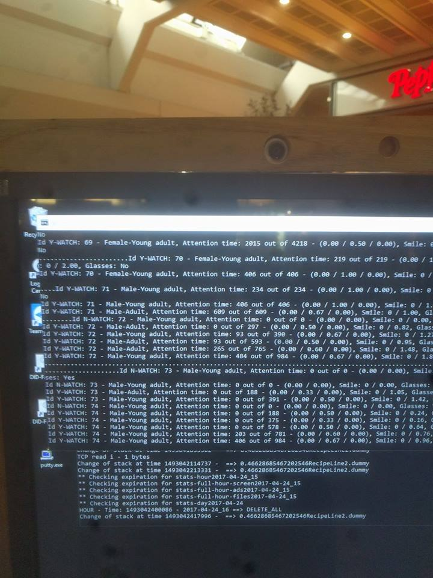

<!--- 
mkdir -p .qmd-pause && mv *.qmd .qmd-pause/ && \
  quarto add r-wasm/quarto-live; \
  mv .qmd-pause/* . && rmdir .qmd-pause
----->




## Dagens program

1. **Fra regler til eksempler.** Hvad maskinlæring er, og hvad det ikke er

2. **En kort historie om AI** og hvorfor det hele sker nu

3. **Hvordan en maskine "ser"**

4. **At lære af ord** eksemplificeret ved en lille sprogmodel

5. **Hvornår er en model god?** Og hvem der bestemmer det

6. **Det digitale samfund**: ansvar, privatliv, rettigheder og diskrimination

## Det, I allerede ved

I dag bygger vi videre på næsten alt, I har lavet indtil nu.

| Fra | Det, vi bruger i dag |
|---|---|
| Lektion 1 | Alt er tal. Og en regel kan oversættes til et program |
| Lektion 4 | Hvad en algoritme er. *Skal vi stadig kode?* |
| Lektion 6 | Ordbøger og tekstanalyse: Think Python kapitel 10 og 12 |

## Hurtig opsummering

::: {style="font-size: 0.8em;"}
:::: {.columns}

::: {.column width="33%"}
**Lektion 1**

- En computer kan kun én ting: regne med tal. Tekst, billeder og lyd er tal, gemt som 0 og 1.
- Den er dum, men hurtig. Den gør præcis det, der står. Hverken mere eller mindre.
- En regel, man kan skrive ned, kan blive til et program:

```python
if indkomst < 300000:
    print("Bevilget")
```

... et billede af en kat er også bare tal.
:::

::: {.column width="33%"}
**Lektion 4**

- En algoritme er en præcis, endelig række trin. Samme input giver altid samme output.
- En funktion har en grænseflade (hvad den får, og hvad den giver) og en implementation, der kan skiftes ud.
- Man skal kunne læse koden. Også den, man ikke selv har skrevet.

... i maskinlæring skriver man én algoritme, der laver en anden.
:::

::: {.column width="33%"}
**Lektion 6**

- En ordbog gemmer en værdi for hver nøgle.
- Med en ordbog kan man tælle, hvor tit hvert ord står i en tekst:

```python
antal = {}
for ordet in "den kat og den hund".split():
    if ordet in antal:
        antal[ordet] = antal[ordet] + 1
    else:
        antal[ordet] = 1
```

... sådan lærer den simpleste sprogmodel.
:::

::::
:::

# Fra regler til eksempler

## Maskinlæring

Et ord, vi ikke kan komme udenom i dag. Men hvad dækker det egentlig over?

<span class="timer" data-time="180"></span>

<br>

Skriv én sætning ned, før vi går videre. Vi kigger på den igen til sidst.

## I lektion 1 skrev I en regel

<span class="timer" data-time="180"></span>

Tilskudsreglen i § 4 kunne oversættes direkte til Python, fordi nogen havde skrevet den ned. I forenklet form:

```python
if indkomst < 300000 and boern > 0:
    print("Bevilget")
```

<br>

::: {.fragment}
Det virker, når reglen findes. Men hvad gør man, når ingen kan skrive den ned?

**Øvelse:** hvad er reglen for, at et billede viser en kat?
:::

## Reglen for en kat

```{pyodide}
#| autorun: false
def er_det_en_kat(dyr):
    """En regel, skrevet af et menneske."""
    return dyr["spidse_oerer"] and dyr["knurhaar"] and dyr["pels"]


kat = {"spidse_oerer": True, "knurhaar": True, "pels": True}
raev = {"spidse_oerer": True, "knurhaar": True, "pels": True}
noegenkat = {"spidse_oerer": True, "knurhaar": True, "pels": False}

print("Kat:      ", er_det_en_kat(kat))
print("Ræv:      ", er_det_en_kat(raev))
print("Nøgenkat: ", er_det_en_kat(noegenkat))
```

---

Ræven er en kat, og nøgenkatten er ikke. Hver gang vi retter reglen, finder nogen et nyt dyr, den ikke passer på. Og i virkeligheden har computeren ikke engang ører og knurhår at se på ... kun tal.

## Fra regler til eksempler

> Computere lærer at løse opgaver og træffe beslutninger baseret på data, uden at være eksplicit programmeret til hver enkelt situation.

::: {.fragment}

* I stedet for at følge faste regler, som et menneske har skrevet, **finder systemet selv mønstre** i eksempler.

* Tænk på, hvordan et barn lærer at genkende en kat. Ikke ved at få en liste af regler (fire ben, spidse ører, pels) men ved at se hundredvis af katte. **Maskinlæring lærer på samme måde: ved at blive vist mange eksempler.**

* Forskellen fra lektion 1: I skrev I reglen. Her skriver man et program, der **finder reglen** selv.

:::

## De tre dele

::: {.incremental}

1. **Data** er grundlaget: billeder, tekst, tal, lyd. Alt, der kan blive til tal. Jo mere relevant og varieret, desto bedre kan systemet lære.

2. **Algoritmen** er fremgangsmåden, der finder mønstrene. Den justerer gradvist en masse indstillinger — *parametre* — så den bliver bedre til opgaven.

3. **Modellen** er resultatet: det, der kommer ud, når algoritmen er færdig. Den kan én bestemt ting, fx genkende katte eller forudsige priser.

:::

## To algoritmer i én

I lektion 4 var en algoritme en præcis, endelig række trin, der tager et input og giver et output. Det gælder også her. Der er bare **to**:

::: {.incremental}

1. **Lærealgoritmen** kører på data og justerer parametrene. Den skriver man som programmør.

2. Den færdige **model** tager et nyt input og giver et svar. Den har ingen skrevet. **Den er lavet af den første algoritme.**

:::

<br>

::: {.fragment}
Det er det nye: en algoritme, der laver en anden algoritme. Lærealgoritmen er præcist beskrevet, men den model, der kommer ud, har ingen programmør skrevet linje for linje.
:::

## Det er allerede en del af hverdagen

::: {.incremental}

* **Netflix** anbefaler serier ud fra, hvad brugere, der ligner dig, har set

* **Din telefon** låser op, når den genkender dit ansigt

* **Oversættelse og chatbots** bygger på modeller, der er trænet på enorme mængder tekst

* **Autokorrektur og tekstforslag**, når du skriver en besked

:::

<span class="timer" data-time="180"></span>

<br>

::: {.fragment}
Hvor har I mødt det i dag?
:::

## AI, ML, deep learning?

Ordene bruges i flæng. Men de ligger "inden i" hinanden:

::: {.incremental}

- **Kunstig intelligens (AI)** er det store felt: alt, hvor maskiner løser opgaver, vi ellers ville kalde intelligente. Også regler skrevet af mennesker

- **Maskinlæring (ML)** er en del af AI: systemer, der lærer fra data i stedet for at få reglerne

- **Deep learning** er en del af ML: store neurale netværk med mange lag

- **Sprogmodeller** som ChatGPT er en del af deep learning

:::

## Hvordan bruger I AI?

> Hvordan har I brugt (generativ) AI på kurset og studiet indtil nu? Hvad har I lært af det — og er der noget, I vil gøre mere eller mindre af?

<span class="timer" data-time="300"></span>

# En kort historie om AI

## 1945–1990: håb og vinter

::: {style="font-size: 0.8em;"}
::: {.incremental}

1. **1945 og frem:** de første computere gør tanken om AI praktisk mulig.

2. **Optimismen i 50'erne og 60'erne:**
    * *Artificial intelligence* får sit navn ved Dartmouth-konferencen i 1956. Ambitionen er tænkende maskiner.
    * **Perceptronen** fra 1958 er det første neurale netværk, der kan lære at skelne simple mønstre.
    * Begrebet ***machine learning*** bruges i 1959 om et program, der lærer at spille dam.
    * Den første chatbot, **ELIZA**, kommer i 1966.

3. **Den første AI-vinter i 70'erne og 80'erne:**
    * Papiret *Perceptrons* fra 1969 viser, hvor lidt de simple neurale netværk kan, og interessen falder.
    * **Ekspertsystemer** (regler skrevet af eksperter) bliver bygget, men er dyre og ufleksible. Det er reglen for en kat, i stor skala.

:::
:::

## 1990–2010: tallene tager over

::: {style="font-size: 0.8em;"}
::: {.incremental}

4. **Maskinlæringens gennembrud i 90'erne:**
    * Nye statistiske metoder som *support vector machines* og neurale netværk, der kan læse håndskrift.
    * **IBM's Deep Blue slår verdensmesteren Garry Kasparov i skak i 1997.**

5. **Big data i 00'erne:**
    * Metoder som *random forests* bliver almindelige.
    * **ImageNet** fra 2009 — millioner af billeder, som mennesker har mærket/tagget — bliver drivkraften bag *computervision*.

:::
:::

<br>

::: {.fragment}
Det centrale ved **ImageNet** er, at gennembruddet ikke kom af en ny idé, men af **data** — og af mange menneskers arbejde med at mærke den.
:::

## 2010–2020: deep learning

::: {style="font-size: 0.8em;"}
::: {.incremental}

6. **Deep learning dominerer:**
    * **AlexNet** vinder ImageNet-konkurrencen i 2012 med et dybt neuralt netværk og flytter hele feltet.
    * IBM's **Watson** vinder Jeopardy, og **Siri** kommer på telefonen, begge i 2011.
    * Ord bliver til tal på en ny måde — *word embeddings* — omkring 2013.
    * **AlphaGo** slår Go-mesteren Lee Sedol i 2016. Go var anset for umuligt for maskiner.
    * **AlphaZero** lærer i 2017 skak, shogi og Go helt fra bunden, ved at spille mod sig selv.
    * **Transformer-modellen** fra 2017 lægger grunden til de chatbots, vi kender i dag.

:::
:::

## 2020'erne: sprogmodellerne

::: {style="font-size: 0.8em;"}
::: {.incremental}

7. **Store sprogmodeller:**
    * **GPT-3** fra 2020 har 175 milliarder parametre og kan løse nye opgaver ud fra få eksempler.
    * Erfaringen fra GPT, GPT-2 og GPT-3 er, at **større modeller på mere data** bliver kvalitativt bedre.
    * **GitHub Copilot** fra 2021 skriver kode ud fra beskrivelser på almindeligt sprog.
    * **ChatGPT** lanceres i november 2022 og har efter to måneder anslået 100 millioner brugere — hurtigere end nogen anden teknologi før.
    * DALL-E, Midjourney og Stable Diffusion gør det muligt at **lave billeder ud fra tekst**.

:::
:::

## Hvorfor nu?

Fire ting har ændret sig ... men kun én af dem er en bedre idé:

* **Computerkraft:** fra store maskinrum til grafikkort og chips bygget specielt til AI

* **Data:** fra datasæt, nogen har lavet i hånden, til hele internettet

* **Algoritmer:** fra den simple perceptron til transformer-modeller

* **Penge:** fra forskning på universiteter til en industri for milliarder

<br>

::: {.fragment}
Kun ét af de fire punkter handler om en bedre idé. De tre andre handler om *mere*: mere regnekraft, mere data og flere penge.
:::

## To spørgsmål

> Er AI noget, der bekymrer jer?

> Hvad håber I, AI vil løse, i jeres liv og/eller på jeres fremtidige arbejde?

<span class="timer" data-time="300"></span>

# Hvordan en maskine "ser"

## Alt er tal

Det første princip fra lektion 1. Et billede er et gitter af tal: hvert tal er én pixels lysstyrke, fra 0 (sort) til 255 (hvid).

```
Kat (forenklet, 8×8):                    Hund (samme størrelse):
[ 10,  15,  20,  25,  25,  20,  15,  10]  [ 10,  15,  20,  20,  20,  20,  15,  10]
[ 15,  80, 120, 140, 140, 120,  80,  15]  [ 15,  70, 100, 110, 110, 100,  70,  15]
[ 20, 180, 250, 255, 255, 250, 180,  20]  [ 20, 150, 200, 210, 210, 200, 150,  20]
[ 25, 200,  90, 220, 220,  90, 200,  25]  [ 25, 170, 180, 200, 200, 180, 170,  25]
[ 25, 180, 180, 200, 200, 180, 180,  25]  [ 25, 165, 175, 185, 185, 175, 165,  25]
[ 20, 160, 240, 190, 190, 240, 160,  20]  [ 20, 160, 170, 180, 180, 170, 160,  20]
[ 15,  90, 150, 160, 160, 150,  90,  15]  [ 15,  80, 140, 160, 160, 140,  80,  15]
[ 10,  15,  20,  25,  25,  20,  15,  10]  [ 10,  15,  20,  25,  25,  20,  15,  10]
```

::: {.fragment}
**Opgaven til "maskinen":** lær forskellen på de to mønstre af tal. Det er alt, maskinen har.
:::

## Første skridt: find de lyse pixels

::: {.kode-split}

```{pyodide}
#| autorun: false
kat = [
    [ 10,  15,  20,  25,  25,  20,  15,  10],
    [ 15,  80, 120, 140, 140, 120,  80,  15],
    [ 20, 180, 250, 255, 255, 250, 180,  20],
    [ 25, 200,  90, 220, 220,  90, 200,  25],
    [ 25, 180, 180, 200, 200, 180, 180,  25],
    [ 20, 160, 240, 190, 190, 240, 160,  20],
    [ 15,  90, 150, 160, 160, 150,  90,  15],
    [ 10,  15,  20,  25,  25,  20,  15,  10],
]

graense = 150

for raekke in kat:
    linje = ""
    for pixel in raekke:
        if pixel > graense:
            linje = linje + "X "
        else:
            linje = linje + ". "
    print(linje)
```

:::

::: {.fragment}
Pludselig kan man se et ansigt og to huller, hvor øjnene er. Men læg mærke til: **vi** valgte grænsen 150. Det er en regel, et menneske har skrevet.
:::

## Fra pixels til begreber

Et neuralt netværk gør det samme, bare uden at nogen har valgt grænsen. Det finder selv ud af, hvad der er værd at se efter, i lag:

::: {.incremental}

1. **Pixels**: tal, som ovenfor

2. **Kanter**: hvor lyst møder mørkt

3. **Former**: runde, spidse, aflange

4. **Dele**: øjne, ører, snude

5. **Hele ting**: en kat

:::

<br>

::: {.fragment}
Ingen har fortalt netværket, at runde former er vigtige. Det **opdagede** det, fordi det hjalp med at løse opgaven. Derfor hedder det *feature learning* — at lære, hvad man skal se efter — i stedet for *feature engineering*, hvor et menneske bestemmer det.
:::

## Det er ikke magi

::: {.incremental}

* **Data er vigtigere end modellen.** Varierede eksempler giver en robust model. Skæve eksempler giver en skæv model.

* **Lidt bedre for hver runde.** Hver gennemgang af data justerer parametrene en lille smule. Efter tusindvis af runder kan modellen noget, der ligner ekspertniveau, men aldrig fejlfrit.

* **Ingen enkelt del "er" katte-detektoren.** Viden ligger spredt ud over millioner af tal.

:::

<br>

::: {.fragment}
Det er systematisk, gentaget mønstergenkendelse i et enormt antal tal. Det vilde er, at noget, der *ligner* forståelse, kan komme ud af så simpel en proces.
:::

## Tre måder at lære på

::: {.incremental}

- **Supervised learning: med facit.** Modellen ser eksempler, hvor svaret er kendt: tusindvis af e-mails, der allerede er mærket *spam* eller *ikke spam*. Den mest almindelige form.

- **Unsupervised learning: uden facit.** Modellen finder selv grupper og mønstre, fx kunder der opfører sig ens. Ingen har sagt, hvilke grupper der findes.

- **Reinforcement learning: med "belønning".** Modellen prøver sig frem og får point for gode træk. Sådan lærte AlphaZero skak.

:::

# At lære af ord

## Natural Language Processing (NLP)

At få en computer til at forstå og lave menneskeligt sprog.

::: {.incremental}

* Et felt mellem **datalogi og lingvistik**

* Mest **statistik**: man tæller ord og ser, hvad der følger hvad med eller uden viden om grammatik

* I hverdagen: ChatGPT, tale-til-tekst, autokorrektur, Google Translate

:::

<br>

::: {.fragment}
(Think Python kapitel 12 tæller ord og finder de hyppigste med en ordbog. Det er præcis, hvad den simpleste sprogmodel gør.)
:::

## Naive Bayes: idéen

Vi har en filmanmeldelse og vil vide, om den er positiv eller negativ.

::: {.incremental}

* Vi har set mange anmeldelser før, og vi ved, hvilke der var positive.

* Nogle ord står oftere i de positive (*fantastisk*, *elsker*). Andre i de negative (*kedelig*).

* For en ny anmeldelse spørger vi: **givet de ord, jeg ser, hvilken slags anmeldelse er det mest sandsynligt?**

:::

<br>

::: {.fragment}
Matematisk hedder det Bayes' sætning:

$$
P(\text{positiv} \mid \text{ordene}) \;\propto\; P(\text{positiv}) \times P(\text{ordene} \mid \text{positiv})
$$

*Hvor sandsynligt er det positivt, når jeg ser de ord?* er proportionalt med *hvor almindelige positive anmeldelser er* gange *hvor almindelige de ord er i positive anmeldelser*.
:::

## Regnestykket

Anmeldelsen er `"Fantastisk film. Elsker!"`. Fra træningsdata ved vi:

| | Positiv | Negativ |
|---|---|---|
| Andel af alle anmeldelser | 0,60 | 0,40 |
| *fantastisk* står i | 8 % | 1 % |
| *film* står i | 15 % | 12 % |
| *elsker* står i | 9 % | 2 % |

---

`"Fantastisk film. Elsker!"`

$$
P(\text{positiv} \mid \text{ordene}) \;\propto\; P(\text{positiv}) \times P(\text{ordene} \mid \text{positiv})
$$

```{pyodide}
#| autorun: false
positiv = 0.6 * 0.08 * 0.15 * 0.09
negativ = 0.4 * 0.01 * 0.12 * 0.02

print(f"positiv: {positiv:.7f}")
print(f"negativ: {negativ:.7f}")
print(f"forhold: {positiv / negativ:.1f}")
print(f"sandsynlighed for positiv: {positiv / (positiv + negativ):.3f}")
```

::: {.aside}
Den sidste linje er **normaliseringen**: de to tal deles med deres sum, så de bliver til sandsynligheder, der giver 1 tilsammen.
:::

## Hvor kommer tallene fra?

De blev talt op med en ordbog (som i Think Python kapitel 10 og 12).

```{pyodide}
#| autorun: false
traening = [
    ("fantastisk film elsker den", "positiv"),
    ("elsker skuespillerne fantastisk", "positiv"),
    ("god film elsker slutningen", "positiv"),
    ("fantastisk historie god musik", "positiv"),
    ("elsker den film", "positiv"),
    ("god og sjov film", "positiv"),
    ("kedelig film", "negativ"),
    ("dårlig historie kedelig slutning", "negativ"),
    ("fantastisk spild af tid", "negativ"),
    ("elsker ikke den her kedelige film", "negativ"),
]

def andel_med(ordet, kategori):
    """Hvor stor en del af kategoriens anmeldelser indeholder ordet?
    Der lægges 1 til i tælleren og 2 i nævneren, så et ord, vi aldrig
    har set i en kategori, ikke giver sandsynligheden 0."""
    anmeldelser = [tekst for tekst, k in traening if k == kategori]
    med = [tekst for tekst in anmeldelser if ordet in tekst.split()]
    return (len(med) + 1) / (len(anmeldelser) + 2)

def klassificer(ny):
    svar = {}
    for kategori in ["positiv", "negativ"]:
        p = len([k for _, k in traening if k == kategori]) / len(traening)
        for ordet in ny.split():
            p = p * andel_med(ordet, kategori)
        svar[kategori] = p
    i_alt = svar["positiv"] + svar["negativ"]
    return {k: round(v / i_alt, 3) for k, v in svar.items()}

print(klassificer("fantastisk film elsker"))
print(klassificer("kedelig film"))
```

## Hvorfor "naiv"?

Modellen regner, som om ordene ikke har noget med hinanden at gøre. Den ser `fantastisk` og `film` hver for sig og ikke `fantastisk film`. Kontekst er i de simple modeller væk og data behandles som en **bag-of-words**.

<br>

::: {.incremental}

* I virkeligheden hænger ord sammen. *"Ikke god"* betyder det modsatte af *"god"*.

* Alligevel virker metoden overraskende godt. Det er en model: den udelader noget, og den kan bruges alligevel.

:::

<br>

::: {.fragment}
**Enhver model udelader noget.** Spørgsmålet er altid, om den udelader noget, der betyder noget for opgaven, der skal løses.
:::

# Hvornår er en model god?

## 99,5 procent rigtigt

> *"Du har en befolkning, hvor 0,5 procent får en alvorlig sygdom, og træner en model til at identificere dem. Modellen opnår hurtigt en træfsikkerhed på 99,5 procent, men er ikke i stand til at identificere en eneste af de syge. Hvad er der sket?"*
>
> fra Inga Strümke's "Masiner der tænker"

<span class="timer" data-time="120"></span>

## Svaret

Den model, der aldrig finder en eneste syg, er 99,5 procent rigtig. **Hvad man måler, bestemmer, hvad modellen lærer** ... og målet er valgt af et menneske.

## Tabsfunktionen er et menneskeligt valg

Hver gang AI træffer en beslutning — en diagnose, et skaktræk, en anbefaling — ligger der menneskelige valg bag.

::: {.incremental}

* **Hvilke data?** Virkelighedens data, med alle dens skævheder, eller et idealbillede, der ikke findes?

* **Hvilken opgave?** Maskiner slår os, fordi vi beder dem om det. Der er ingen skjult motivation: chatbots som Microsofts *Tay* sagde voldsomme ting, fordi de havde lært det af brugerne.

* **Hvornår er den god nok?** **Tabsfunktionen** måler, hvor langt modellen er fra at løse opgaven. Den skrives af et menneske. Og det er et menneske, der bestemmer, hvornår fejlen er lille nok til, at modellen er færdig.

:::

## Hvad ML *ikke* er

* Tilfældigt prøv-dig-frem uden struktur

* Mystisk intelligens uden noget mekanisk bag

* Uforklarligt på algoritmeniveau ... selvom det når en kompleksitet, der gør det essentielt umuligt forklare den enkelte beslutning i de avancerede modeller

* Menneskelig forståelse eller intuition

## Hvilke problemer opstår?

Maskinlæring er ikke en universalløsning.

::: {.incremental}

* **Den er kun så god som sine data.** En ansigtsgenkender, der primært er trænet på én slags ansigter, fejler på andre.

* **Den kan være en "black box".** Selv når man kender algoritmen, kan det være umuligt at forklare, *hvorfor* modellen traf netop den beslutning. Det er et problem, hvor forklaringen er vigtig: i sundhedsvæsenet og i retten.

* **Den koster.** Store modeller kræver enorme mængder data og strøm.

:::

# Det digitale samfund

## Det digitale samfund 

> Når flere og flere dele af vores liv bliver digitale, stiller det ikke kun krav til systemerne. Det rejser også grundlæggende spørgsmål, der er tekniske såvel som etiske.

<br>

::: {.incremental}
- I 2022 påstod en Google-ingeniør, at chatbotten [LaMDA](https://arstechnica.com/tech-policy/2022/07/google-fires-engineer-who-claimed-lamda-chatbot-is-a-sentient-person/) havde bevidsthed. (Han blev fyret.) Hvad siger det om, hvor overbevisende en sprogmodel kan være ... og om os?
:::

## Tempe, Arizona, 2018

{fig-align="center" width=50%}

::: {.incremental}

* En selvkørende testbil fra Uber påkørte og dræbte en kvinde, der trak sin cykel over vejen.

* Systemet så hende i flere sekunder, men vidste ikke, hvad det så: skiftevis et køretøj, en cykel og *andet*. Det var aldrig lært at forvente en fodgænger uden for et fodgængerfelt.

* Et **klassifikationsproblem**: der var en fodgænger, og systemet sagde *ikke fodgænger*. Det kaldes en **falsk negativ**.

:::

## Hvem bærer skylden?

{fig-align="center" width=40%}

> Maskinen eller Rafaela, der sad bag rattet som sikkerhedschauffør?

<span class="timer" data-time="300"></span>

::: {.fragment}
Og hvad med dem, der valgte de data, systemet blev trænet på? Og dem, der slog nødbremsen fra for at få en roligere tur?
:::

## Kan en maskine være sexistisk eller racistisk?

To holdninger, man principielt kan forsvare:

:::: {.columns}
::: {.column width="40%"}
**Nej.** En maskine forholder sig kun til tal. Den har ingen holdninger. Men der findes stadig systematisk sexisme og racisme i samfundet *og den står i de data, vi træner modellerne på.*
:::

::: {.column width="20%"}
:::

::: {.column width="40%"}
**Ja, i praksis.** Hvis et system træffer beslutninger, der rammer kvinder eller minoriteter skævt, er virkningen den samme, uanset om nogen mente det. *Det er beslutningen, der rammer, ikke hensigten.*
:::
::::

<br>

::: {.fragment}
Hvilken af de to synes I er rigtigst? Og betyder det noget for, hvad man skal gøre ved det?
:::

## Skyggesiderne af det digitale samfund 

<br>

**De klassiske:**

- Datasikkerhed
- Privatliv
- Rettigheder og ejerskab

**De nye:**

- Diskrimination og gennemsigtighed
- Klima
- Ubegrundet eller overdreven optimisme?

## (Data)sikkerhed 

::: {.incremental}
* **GDPR**: for lidt og for meget?
    * Forskning, der ikke må bruges i praksis.
    * Personfølsomme oplysninger kan *udledes* af data, der ikke var følsomme i sig selv ([et studie fra 2018 på Facebook-data](https://doi.org/10.1073/pnas.1802331115)).
    * Gå ud fra, at de store techvirksomheder ved *mindst* lige så meget om dig, som du selv gør.
    * Giver mere regulering mening, når vi ikke ved, hvad der bliver muligt i morgen?
:::

<span class="timer" data-time="300"></span>

## Privatliv (1) 

::: {.incremental}
- Næsten alt, vi gør med digitale værktøjer — computer, telefon, tv, sociale medier, kort, betalingskort — **skaber data**.
  - I praksis er data ikke anonyme længere. Når der er nok af dem, er det let at finde frem til den enkelte.
  - **The privacy paradox**: vi siger, at vi værner om privatlivet, og deler alligevel det hele.
  - Det meste data er ikke *for* os. Det er *om* os.
:::

<span class="timer" data-time="300"></span>

## Privatliv (2)

{fig-align="center" width=50%}

::: {.incremental}
- **Anonymous Video Analytics** i en reklameskærm: køn, aldersgruppe, hvor længe man kigger, og om man smiler.
- Teslas biler filmer gadebilledet hele tiden. Hvorfor er det mere acceptabelt?
:::

## Privatliv (3)

- **Federated learning**: Google fandt en måde at træne modeller på vores telefoner uden at sende vores data hjem, **kun parametrene**.
- **Formålsglidning**: data, der blev samlet ind til ét formål, bliver brugt til et andet. Det bedste eksempel er NSA.
- De techvirksomheder, der ved mest om os, er primært amerikanske. Resten er overvejende kinesiske.

<span class="timer" data-time="300"></span>

## Rettigheder og ejerskab 

::: {.incremental}
- Hvad ejer vi egentlig, når det først ligger på nettet?

- OpenAI skrev i 2022: *you own the generations you create with DALL-E* ([pkt. 5](https://help.openai.com/en/articles/6704941-dall-e-api-faq)).
  - **AI er kreativ** i en snæver forstand af ordet. Men modellerne er trænet på "dit" arbejde.

- Man kan ikke lave plagiatkontrol på en AI-model, men …
  - **Bør AI-genereret indhold have et vandmærke?**
:::

<span class="timer" data-time="300"></span>

## Diskrimination og gennemsigtighed (1) 

[Amazon skrottede et AI-system til rekruttering, der var skævt mod kvinder](https://www.ml.cmu.edu/news/news-archive/2016-2020/2018/october/amazon-scraps-secret-artificial-intelligence-recruiting-engine-that-showed-biases-against-women.html)

::: {.incremental}
  - Det endte som en *mande-detektor*. Det var trænet på ti års ansøgninger fra en branche, hvor mænd var i flertal.
  - Er modellen sexistisk, hvis den kun har kendt en verden, hvor der var strukturel sexisme? 
  - **Kan data være skæve eller er data bare?** Og hvis data bare er, hvem har så ansvaret for, hvad modellen lærer af dem?
  - **Gennemsigtighed eller regulering?**
:::

## Diskrimination og gennemsigtighed (2) 

*Scrolling, autonomi og selvforstærkende mekanismer.*

::: {.incremental}
- Danner vi selv vores ønsker, eller bliver vi skubbet i retning af bestemte ønsker?
- **Anbefalingssystemer**: er det tilpasning eller manipulation?
- **Deep fakes** i billede og lyd. Google valgte ikke at frigive lydmodellen *AudioLM* af frygt for misbrug: den lyd, den lavede, var stort set umulig at skelne fra ægte.
:::
